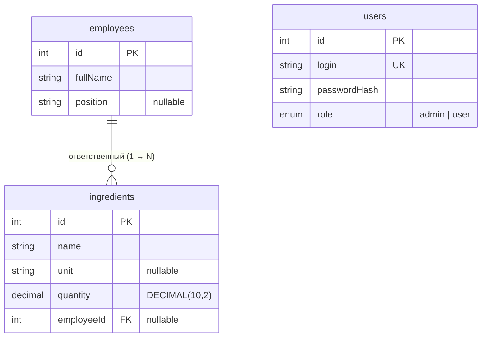

# База данных

СУБД — **MySQL 8.4**. Доступ из приложения — через **Prisma ORM**. Схема состоит из **трёх таблиц**: `users`, `employees`, `ingredients`.

## ER-диаграмма



Текстом:

```
┌──────────────┐ 1        N ┌──────────────┐        ┌──────────────┐
│  employees   │───────────<│ ingredients  │        │    users     │
└──────────────┘            └──────────────┘        └──────────────┘
 один сотрудник —            ingredients.employeeId   независимая
 ответственный за            → employees.id           таблица
 много ингредиентов          (ON DELETE SET NULL)     аутентификации
```

## Таблицы

### `users` — пользователи системы

| Поле | Тип | Ограничения | Описание |
|---|---|---|---|
| `id` | INTEGER | PK, AUTO_INCREMENT | Идентификатор |
| `login` | VARCHAR | NOT NULL, UNIQUE | Логин для входа |
| `passwordHash` | VARCHAR | NOT NULL | bcrypt-хеш пароля (наружу не отдаётся) |
| `role` | ENUM(`admin`,`user`) | NOT NULL, DEFAULT `user` | Роль |

### `employees` — сотрудники

| Поле | Тип | Ограничения | Описание |
|---|---|---|---|
| `id` | INTEGER | PK, AUTO_INCREMENT | Идентификатор |
| `fullName` | VARCHAR | NOT NULL | ФИО |
| `position` | VARCHAR | NULL | Должность |

### `ingredients` — ингредиенты

| Поле | Тип | Ограничения | Описание |
|---|---|---|---|
| `id` | INTEGER | PK, AUTO_INCREMENT | Идентификатор |
| `name` | VARCHAR | NOT NULL | Наименование |
| `unit` | VARCHAR | NULL | Единица измерения (кг, г, л, шт) |
| `quantity` | DECIMAL(10,2) | NOT NULL, DEFAULT 0 | Количество на складе |
| `employeeId` | INTEGER | NULL, FK → `employees.id` | Ответственный сотрудник |

**Связь:** `employees` 1 → N `ingredients`. При удалении сотрудника `employeeId` у его ингредиентов обнуляется (`ON DELETE SET NULL`) — ингредиенты остаются, просто без ответственного.

## Схема Prisma

Источник истины — [server/prisma/schema.prisma](server/prisma/schema.prisma):

```prisma
enum Role {
  admin
  user
}

model User {
  id           Int    @id @default(autoincrement())
  login        String @unique
  passwordHash String
  role         Role   @default(user)
  @@map("users")
}

model Employee {
  id          Int          @id @default(autoincrement())
  fullName    String
  position    String?
  ingredients Ingredient[]
  @@map("employees")
}

model Ingredient {
  id         Int       @id @default(autoincrement())
  name       String
  unit       String?
  quantity   Decimal   @default(0) @db.Decimal(10, 2)
  employee   Employee? @relation(fields: [employeeId], references: [id], onDelete: SetNull)
  employeeId Int?
  @@map("ingredients")
}
```

## SQL миграции (DDL)

Миграции лежат в [server/prisma/migrations/](server/prisma/migrations/). Начальная миграция `init`:

```sql
CREATE TABLE `users` (
  `id` INTEGER NOT NULL AUTO_INCREMENT,
  `login` VARCHAR(191) NOT NULL,
  `passwordHash` VARCHAR(191) NOT NULL,
  `role` ENUM('admin', 'user') NOT NULL DEFAULT 'user',
  UNIQUE INDEX `users_login_key`(`login`),
  PRIMARY KEY (`id`)
);

CREATE TABLE `employees` (
  `id` INTEGER NOT NULL AUTO_INCREMENT,
  `fullName` VARCHAR(191) NOT NULL,
  `position` VARCHAR(191) NULL,
  PRIMARY KEY (`id`)
);

CREATE TABLE `ingredients` (
  `id` INTEGER NOT NULL AUTO_INCREMENT,
  `name` VARCHAR(191) NOT NULL,
  `unit` VARCHAR(191) NULL,
  `quantity` DECIMAL(10, 2) NOT NULL DEFAULT 0,
  `employeeId` INTEGER NULL,
  PRIMARY KEY (`id`)
);

ALTER TABLE `ingredients` ADD CONSTRAINT `ingredients_employeeId_fkey`
  FOREIGN KEY (`employeeId`) REFERENCES `employees`(`id`)
  ON DELETE SET NULL ON UPDATE CASCADE;
```

## Начальные данные (сид)

Скрипт [server/prisma/seed.ts](server/prisma/seed.ts) создаёт администратора по умолчанию (логин/пароль из `.env`: `ADMIN_LOGIN` / `ADMIN_PASSWORD`, по умолчанию `admin`/`admin`). Использует `upsert`, поэтому безопасен при повторном запуске.

## Команды Prisma

Выполняются внутри `server/` (или в контейнере `server`):

```bash
npx prisma migrate dev --name <имя>   # создать и применить миграцию (разработка)
npx prisma migrate deploy             # применить существующие миграции (прод/контейнер)
npx prisma generate                   # сгенерировать Prisma Client
npx prisma db seed                    # засеять начальные данные
npx prisma studio                     # визуальный просмотр БД в браузере
```

В Docker миграции и сид выполняются автоматически при старте контейнера `server`
(`prisma generate && prisma migrate deploy && prisma db seed`).

## Соответствие исходной (десктопной) БД

В исходном WPF-приложении таблицы и поля были на кириллице — при переносе в веб переименованы в латиницу:

| Было (десктоп) | Стало (веб) |
|---|---|
| `Пользователь` / `Сотрудники` / `Ингредиенты` | `users` / `employees` / `ingredients` |
| `Логин`, `Пароль` (открытый текст) | `login`, `passwordHash` (bcrypt) |
| `Роль` (строка) | `role` (ENUM) |
| `ФИО`, `Должность` | `fullName`, `position` |
| `Имя`, `ЕдиницаИзмерения` | `name`, `unit` |
| `Количество` (строка) | `quantity` (DECIMAL) |
