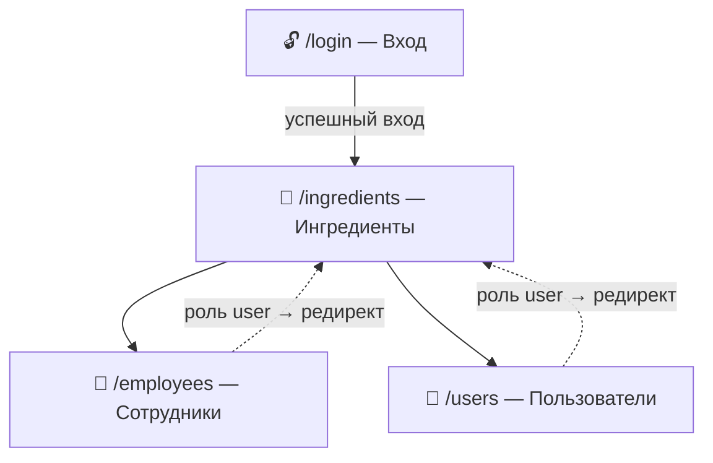

# Дизайн-макет интерфейса

Интерфейс построен на **Ant Design** в стиле административной панели: тёмная верхняя шапка, боковое меню разделов и область с таблицей данных. Локализация — русская (`ru_RU`).

## Карта экранов и навигация



- Неавторизованный пользователь с любой страницы перенаправляется на `/login`.
- Разделы «Сотрудники» и «Пользователи» доступны только администратору (для роли `user` пункты меню скрыты, а прямой переход по адресу редиректит на «Ингредиенты»).

## Экран входа

```
            ┌───────────────────────────┐
            │         🥖 Пекарня         │
            │                           │
            │  Логин                    │
            │  ┌─────────────────────┐  │
            │  │                     │  │
            │  └─────────────────────┘  │
            │  Пароль                   │
            │  ┌─────────────────────┐  │
            │  │ ••••••••            │  │
            │  └─────────────────────┘  │
            │  ┌─────────────────────┐  │
            │  │        Войти        │  │
            │  └─────────────────────┘  │
            └───────────────────────────┘
```

Карточка по центру экрана (`Card` + `Form`). При неверных данных — всплывающее уведомление об ошибке.

## Основной каркас (после входа)

```
┌─────────────────────────────────────────────────────────────┐
│ 🥖 Пекарня                          admin (admin)  [Выход]   │  Header
├───────────────┬─────────────────────────────────────────────┤
│ Ингредиенты   │                                             │
│ Сотрудники *  │             ОБЛАСТЬ КОНТЕНТА                 │  Sider + Content
│ Пользователи* │          (таблица текущего раздела)         │
│               │                                             │
└───────────────┴─────────────────────────────────────────────┘
  * — видно только администратору
```

- **Header** — логотип, имя и роль текущего пользователя, кнопка «Выход».
- **Sider** — вертикальное меню разделов (`Menu`), активный пункт подсвечен.
- **Content** — таблица выбранного раздела.

## Страница раздела (на примере «Ингредиенты»)

```
┌───────────────────────────────────────────────────────────────┐
│ [ + Добавить ]   [ Поиск по названию              🔍 ]        │
├──────┬────────────┬──────────┬──────────┬─────────────┬───────┤
│  ID  │ Название   │ Ед. изм. │ Кол-во   │ Ответствен. │ Дейст.│
├──────┼────────────┼──────────┼──────────┼─────────────┼───────┤
│  1   │ Мука       │ кг       │ 50       │ Иван Пекарь │ ✎  🗑 │
│  2   │ Сахар      │ кг       │ 20       │ —           │ ✎  🗑 │
└──────┴────────────┴──────────┴──────────┴─────────────┴───────┘
```

- Кнопка **«Добавить»** открывает модальное окно с формой.
- **«Редактировать»** (✎) — та же форма с заполненными полями.
- **«Удалить»** (🗑) — с подтверждением (`Popconfirm`).
- Поле поиска есть только на странице ингредиентов (фильтр по названию).

Страницы «Сотрудники» и «Пользователи» устроены так же, отличаются составом колонок:

| Раздел | Колонки таблицы |
|---|---|
| Ингредиенты | ID, Название, Ед. изм., Количество, Ответственный, Действия |
| Сотрудники | ID, ФИО, Должность, Действия |
| Пользователи | ID, Логин, Роль (бейдж), Действия |

## Модальное окно добавления / редактирования

```
            ┌─────────────────────────────────────┐
            │ Новый ингредиент                [×] │
            ├─────────────────────────────────────┤
            │ Название *                          │
            │ ┌─────────────────────────────────┐ │
            │ └─────────────────────────────────┘ │
            │ Единица измерения                   │
            │ ┌─────────────────────────────────┐ │
            │ └─────────────────────────────────┘ │
            │ Количество                          │
            │ ┌─────────────────────────────────┐ │
            │ └─────────────────────────────────┘ │
            │ Ответственный сотрудник             │
            │ ┌─────────────────────────────────┐ │
            │ │ Иван Пекарь                 ▼  │ │
            │ └─────────────────────────────────┘ │
            │                  [ Отмена ] [Сохранить]
            └─────────────────────────────────────┘
```

Поля с `*` — обязательные (валидация на клиенте). Ответственный выбирается из выпадающего списка сотрудников.

## Поведение по ролям

| Действие | Администратор | Пользователь |
|---|---|---|
| Раздел «Ингредиенты» (CRUD) | ✅ | ✅ |
| Раздел «Сотрудники» | ✅ | ⛔ скрыт |
| Раздел «Пользователи» | ✅ | ⛔ скрыт |
| Видит пункты меню | все три | только «Ингредиенты» |

## Используемые компоненты Ant Design

| Экран / элемент | Компоненты |
|---|---|
| Вход | `Card`, `Form`, `Input`, `Input.Password`, `Button` |
| Каркас | `Layout` (`Header`/`Sider`/`Content`), `Menu`, `Typography`, `Space` |
| Таблицы | `Table`, `Tag` (роль), `Button`, `Popconfirm` |
| Формы | `Modal`, `Form`, `Input`, `InputNumber`, `Select` |
| Уведомления | `App.useApp().message` |

## Визуальная концепция

- **Палитра** — стандартная тема Ant Design: синий акцент (кнопки), тёмная шапка, светлое боковое меню.
- **Роли** в таблице пользователей — цветными бейджами (`Tag`): администратор — золотой, пользователь — синий.
- **Эмодзи 🥖** — лёгкий тематический акцент в шапке и на экране входа.
- Реализация макета — в [client/src/components/](client/src/components/) (каркас) и [client/src/features/](client/src/features/) (страницы).
